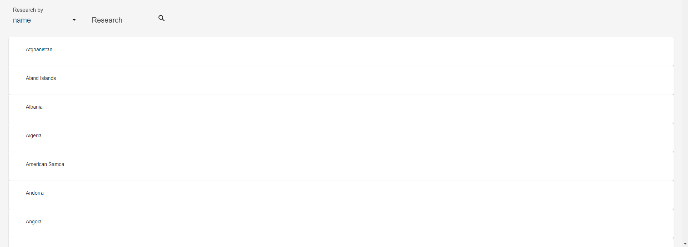
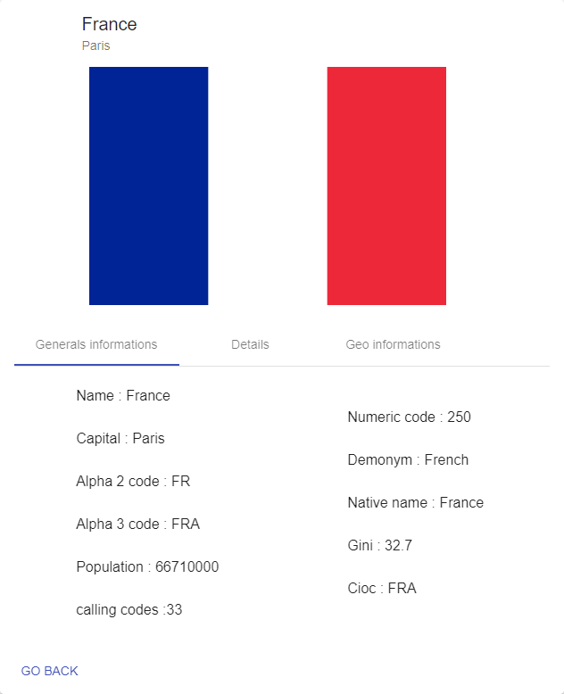

# Country

Country, a GUI based on ANGULAR 6 allowing to search informations about countries.

## Travis

## Getting Started

These instructions will get you a copy of the project up and running on your local machine for development and testing purposes.

### Prerequisites

- [Angular](https://angular.io/) : Angular is a platform that makes it easy to build applications with the web.

### Use

header showing the name of the application.

shortcut area to list the countries corresponding to different criteria, buttons have the following functions: home, global search, Asian countries, European countries, African countries, Oceania countries, American countries, countries with euro's currencies, countries with USD 's currencies and  countries with yen's currencies.

search area to select countries according to different criteria and the display area of ​​the list of selected countries. Countries a clickable in order to display details about it.

display area of ​​detail information of a selected country. Some informations are clickable and display the research component with the pre-filled inputs.

## Authors

* **MANCIAUX Romain** - *Initial work* - [PamplemousseMR](https://github.com/PamplemousseMR).

## License

This project is licensed under the GNU Lesser General Public License v3.0 - see the [LICENSE.md](LICENSE.md) file for details.